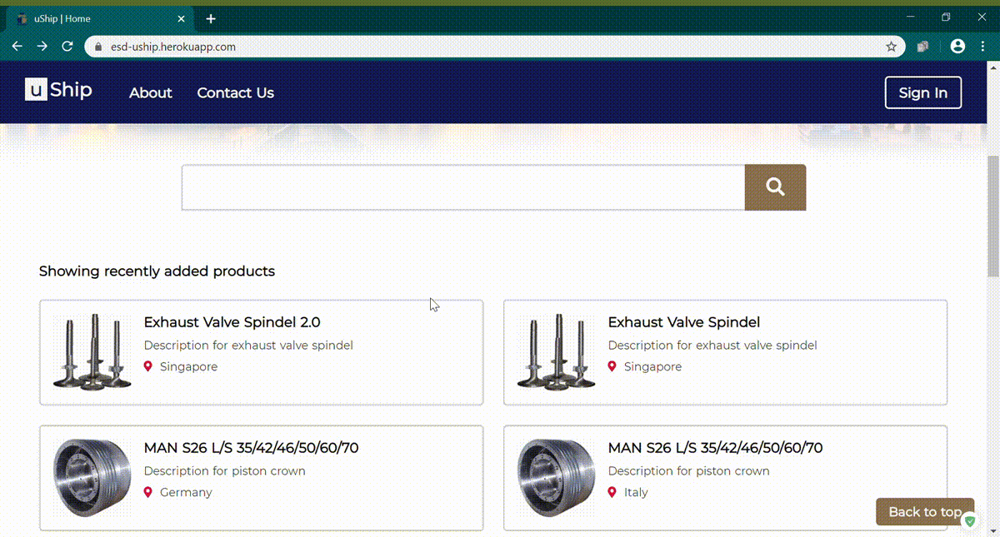
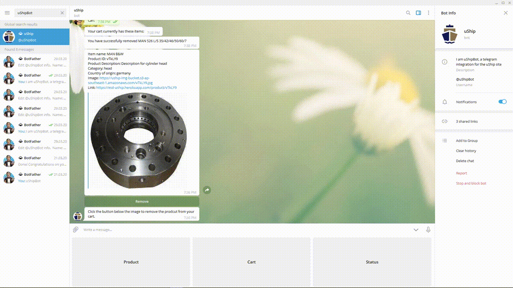
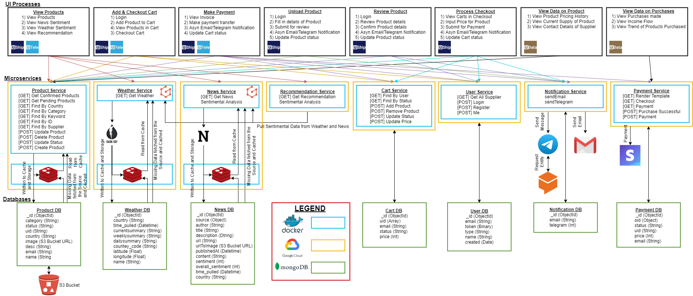
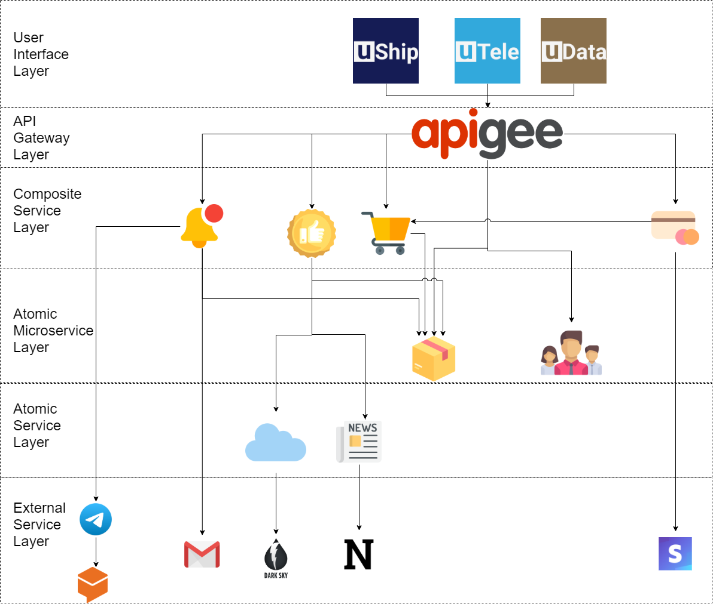
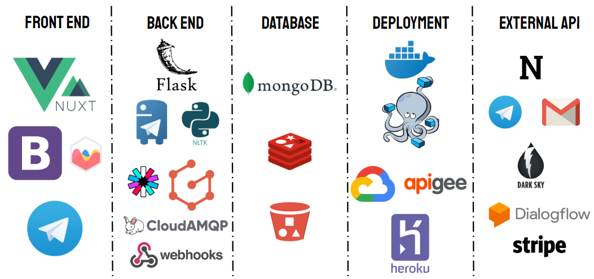

# uShip - Microservices
 [](https://github.com/nicolaswee/uShip-Microservices/graphs/contributors) [](https://GitHub.com/nicolaswee/uShip-Microservices/pull/) [](https://GitHub.com/nicolaswee/uShip-Microservices/pull/) [](https://GitHub.com/nicolaswee/uShip-Microservices/issues/) [](https://GitHub.com/nicolaswee/uShip-Microservices/issues?q=is%3Aissue+is%3Aclosed)

### Details
> UShip allows for customers to view and purchase products like an online e-store. It also allows suppliers to upload their products for sale

>UData is a dashboard for admins to keep track of the overall profits of UShip, product approval statuses, contacts of suppliers, etc.

>UTele integrates the functionality on Telegram. It allows users to view, add, remove items from their cart.

## uShip Overview


## uData Overview


## uTele Overview


## Technical Overview


## Service Oriented Architecture


## Technical Stack


#### Running on localhost:
``` bash
# Cart Microservice
$ cd cart
$ pip install -r requirements.txt
$ python cart.py

# News Microservice
$ cd news
$ pip install -r requirements.txt
$ python news.py
# OR
$ docker-compose up

# Notification Microservice
$ cd notification
$ pip install -r requirements.txt
$ python notification.py

# Payment Microservice
$ cd payment
$ pip install -r requirements.txt
$ python payment.py

# Product Microservice
$ cd product
$ pip install -r requirements.txt
$ python product.py
# OR
$ docker-compose up

# Recommendation Microservice
$ cd recommendation
$ pip install -r requirements.txt
$ python recommendation.py

# User Microservice
$ cd user
$ pip install -r requirements.txt
$ python user.py

# Weather Microservice
$ cd weather
$ pip install -r requirements.txt
$ python weather.py
# OR
$ docker-compose up

# GraphQL Microservice
$ cd graphql
$ pip install -r requirements.txt
$ python app.py

# Changing of Environment URLs
# Currently all URLs are pointing to our API Gateway, if it goes down please do change the URLs in the environment files to localhost
```

## Ports
- GraphQL = 5000
- Product = 5001
- Cart = 5002
- News = 5003
- Weather = 5004
- Recommendation = 5005
- Payment = 5006
- User = 5007

[](https://www.python.org/) [](https://GitHub.com/) [](https://GitHub.com/nicolaswee/) <a href="https://twitter.com/nicolasmarcwee" alt="twitter"></a>
